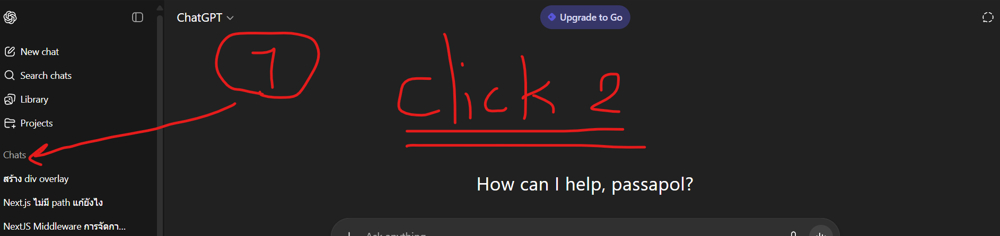

# Python Auto Delete GPT History Bot

โปรแกรมอัตโนมัติสำหรับลบประวัติการสนทนาใน ChatGPT โดยใช้ Python PyAutoGUI

## ความต้องการของระบบ

- Python 3.x
- PyAutoGUI library
- เว็บเบราว์เซอร์ที่เปิด ChatGPT ไว้

## การติดตั้ง

1. ติดตั้ง PyAutoGUI:
```bash
pip install pyautogui
```

## วิธีใช้งาน

1. เปิดเว็บเบราว์เซอร์และเข้าสู่ https://chatgpt.com/
2. รอจนหน้าเว็บพร้อมใช้งาน
3. แก้ไขจำนวนแชทที่ต้องการลบในไฟล์ [index.py:6](index.py#L6):
   ```python
   repeat = 10  # เปลี่ยนเป็นจำนวนที่ต้องการ
   ```
4. รันโปรแกรม:
   ```bash
   python index.py
   ```
5. **ภายใน 3 วินาที** กดที่ปุ่ม **"Chats"** 2 ครั้ง เพื่อปิด-เปิดประวัติการสนทนา ตามรูปด้านล่าง:



6. โปรแกรมจะทำงานอัตโนมัติและลบประวัติตามจำนวนที่กำหนด

## หมายเหตุ

- โปรแกรมจะรอ 3 วินาทีก่อนเริ่มทำงาน เพื่อให้คุณมีเวลาเตรียมตัว
- ควรวางเมาส์ไว้ในตำแหน่งที่เหมาะสมก่อนโปรแกรมเริ่มทำงาน
- แนะนำให้ทดสอบกับจำนวนน้อยๆ ก่อน (เช่น `repeat = 1`)

## คำเตือน

- โปรแกรมนี้จะควบคุมเมาส์และคีย์บอร์ดอัตโนมัติ อย่าขยับเมาส์ระหว่างที่โปรแกรมทำงาน
- การลบแชทจะไม่สามารถกู้คืนได้

